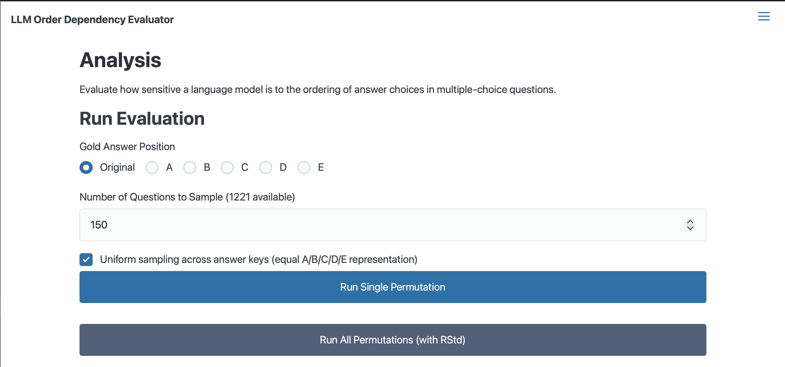
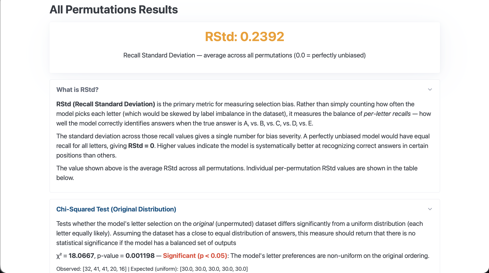
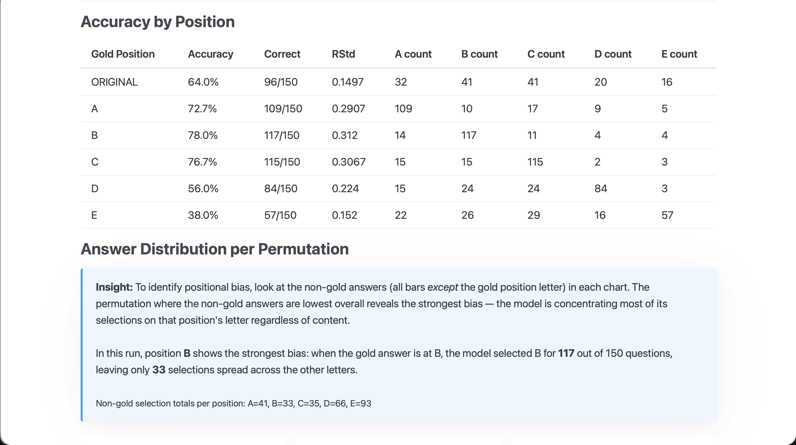
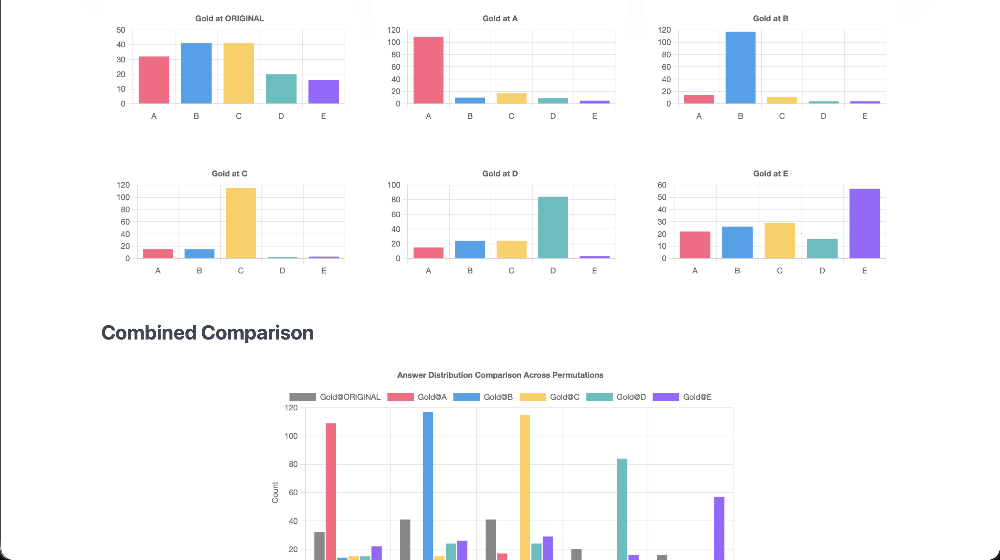
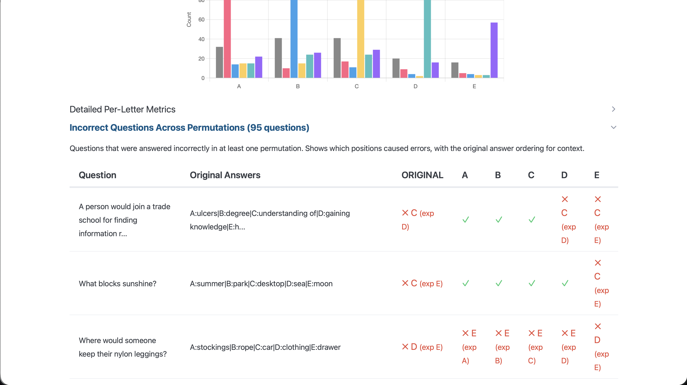

# LLM Order Dependency Evaluator

A web application that explores the **order dependency problem** in large language models: the phenomenon where an LLM's answer to a multiple-choice question changes depending on the position of the correct answer among the options.

## The Order Dependency Problem

LLMs can exhibit **selection bias** when answering multiple-choice questions: they may favor answers in certain positions (e.g., always preferring option A) regardless of content. This application measures and visualizes this sensitivity by systematically moving the correct answer to each position (A through E for the Commonsense Question Answering (CommonsenseQA) dataset) and observing how the model's responses change.

The primary metric to quantify the selection bias is **RStd (Recall Standard Deviation)** — the standard deviation of per-letter recall values across answer positions. Rather than simply counting how often the model picks each letter (which can be skewed by label imbalance), RStd measures how well the model correctly identifies answers at each position. 
An RStd of 0 means the model recalls each letter equally well (no bias); higher values indicate systematic bias. Another metric to quantify this 
is the Chi-Squared test, which, presuming the answer distribution in the dataset is equal, tries to find if there is one option 
that was chosen significantly more than any of the others.

## Architecture

```
┌──────────────┐     ┌──────────────────┐     ┌───────────────┐
│ DatasetEval- │     │    App(FastAPI)  │     │  ModelEval-   │
│   uator      │────▶│  Orchestration   │────▶│    uator      │
│              │     │  Metrics & RStd  │     │               │
│ load_dataset │     │  CSV Export      │     │ load_model    │
│ sample       │     │  Web UI          │     │ run_dataset   │
│ permute      │     └──────────────────┘     │ on_model      │
└──────────────┘                              └───────────────┘
```

### Classes

- **`ModelEvaluator`** (`model_evaluator.py`): Loads a language model via HuggingFace Transformers (or connects to an OpenAI-compatible API), formats MCQ prompts, runs batched inference, and extracts answer letters. Supports both local GPU/CPU models and remote endpoints (vLLM, Ollama, LM Studio, etc.).
- **`DatasetEvaluator`** (`dataset_evaluator.py`): Loads the tau/commonsense_qa dataset (or custom datasets), samples questions with optional uniform sampling across answer keys, and permutes answer orderings to place the correct answer at specified positions.
- **`App`** (`app.py`): FastAPI server that orchestrates the evaluators, computes metrics (accuracy, precision/recall per letter, RStd, chi-squared test), serves the web interface with Chart.js visualizations, and exports results as CSV.

## Installation

### Prerequisites

- [Conda](https://docs.conda.io/projects/conda/en/latest/user-guide/install/index.html) (Miniconda or Anaconda)
- Python 3.10+ (installed via conda)
- GPU recommended (~5 GB VRAM for Qwen3.5-2B in float16). CPU works but inference is significantly slower.
- Alternatively, use a remote OpenAI-compatible API endpoint (no GPU needed locally).

### Setup

```bash
# Clone the repository
git clone https://github.com/pedrocolon93/enfi_takehome
cd enfi_takehome

# Create a conda environment with Python 3.10
conda create -n enfi_takehome python=3.10
conda activate enfi_takehome

# Install dependencies, if using a GPU in linux uncomment the flash-linear-attention line for extra acceleration
pip install -r requirements.txt
```

## Running the Application

```bash
python app.py
```

The server starts at **http://localhost:8000**. On first startup with a local model, it downloads the model (~4.5 GB) and dataset from HuggingFace Hub — this may take several minutes.

## Usage

### Web Interface

The application has three pages accessible via the hamburger menu:

**Analysis (/)** — Main evaluation page:
1. **Select a gold answer position**: Choose where the correct answer should be placed (A, B, C, D, E) or "Original" to keep the dataset's native ordering.
2. **Set sample size**: Choose how many questions to evaluate (shows total available).
3. **Uniform sampling**: Optionally enable uniform sampling across answer keys (A-E) to ensure balanced label representation, avoiding dataset imbalance skewing metrics.
4. **Run Single Permutation**: Evaluates the model with the selected position and shows a bar chart, per-letter precision/recall, RStd, incorrect questions, and a folded raw data table.
5. **Run All Permutations**: Runs all 6 configurations (Original + A through E), computes per-position RStd and an overall average, and shows comparative charts with bias insights.
6. **Download CSV**: Export the raw results for offline analysis.
7. **Cancel**: Stop an ongoing evaluation between batches.

**Generate Dataset (/generate_dataset)** — Create custom MCQ datasets:
1. Specify a topic and number of questions.
2. The configured LLM generates questions in commonsense_qa format.
3. Preview, save to server, export as JSON, or use directly for evaluation.

**Settings (/settings)** — Configure the evaluation:
- **Backend**: Switch between local HuggingFace model or OpenAI-compatible API endpoint (thinking models do not work currently).
- **Generation parameters**: Temperature, max new tokens, top-p, seed, batch size.
- **Dataset**: Change the HuggingFace dataset or import a custom JSON dataset.
- **Test Connection**: Verify a remote API endpoint with a hello world test.

### CSV Export

The exported CSV contains one row per question per permutation:

| Column | Description |
|--------|-------------|
| `id` | Question identifier |
| `question` | Question text |
| `gold_position` | Which permutation was applied (original/A/B/C/D/E) |
| `original_ordering` | Original answer choices as `A:text\|B:text\|...` |
| `permuted_ordering` | Permuted answer choices after reordering |
| `original_answer_key` | Correct answer letter in original ordering |
| `permuted_answer_key` | Correct answer letter after permutation |
| `model_answer` | Letter the model selected |
| `model_raw_response` | Raw text generated by the model |
| `correct` | Whether the model's answer was correct |

## How This Application Demonstrates Order Dependency

The core demonstration works by holding the question content constant while varying only where the correct answer appears among the choices:

1. A fixed set of questions is sampled (same seed ensures identical questions across all permutations).
2. For each permutation (A through E), the correct answer text is moved to that position while distractors maintain their relative order.
3. The model answers each permuted version independently.
4. If the model were truly order-invariant, accuracy and answer distribution would be identical across all permutations. Any differences directly demonstrate order dependency.
5. The plot with the most answers that are *in* the permutation position is where the model's bias is strongest and vice versa. 

The **Incorrect Questions Across Permutations** viewer makes this especially visible: it shows a matrix of which questions the model got wrong at which positions, with the original answer orderings for context, making it easy to spot patterns where moving the correct answer causes the model to fail.

## Evaluation Methodology

### Permutation Strategy

For each target position P (A-E):
1. The correct answer text is removed from its current position.
2. It is inserted at position P.
3. The remaining distractor answers maintain their relative order.
4. All choices are re-labeled A through E.

This isolates the effect of answer position from other confounds.

### Metrics

- **Accuracy**: Fraction of questions answered correctly per permutation.
- **Per-letter Precision**: Of all times the model chose letter L, how often was L actually correct?
- **Per-letter Recall**: Of all questions where L was the correct answer, how often did the model choose L?
- **RStd (Recall Standard Deviation)**: Standard deviation of per-letter recall values. Measures selection bias severity — RStd = 0 means unbiased, higher values indicate the model recognizes answers better in some positions than others. Computed per permutation and averaged across all permutations for an overall score.
- **Chi-Squared Test**: Applied to the original (unpermuted) distribution to test whether the model's letter selection is significantly non-uniform (p < 0.05 indicates bias).
- **Bias Insight**: Automatically identifies which position shows the strongest bias by finding the permutation where non-gold answer selections are lowest (the model concentrates selections on that position's letter).

### Model Parameters

All parameters are configurable in Settings:

- **Model**: Qwen/Qwen3.5-2B by default (2 billion parameter causal LM), or any OpenAI-compatible endpoint
- **Decoding**: Greedy (`temperature=0`, `do_sample=False`) for deterministic results by default
- **Max new tokens**: 10 (only a single letter is expected)
- **Top-p**: 1.0 (no nucleus filtering by default)
- **Seed**: 42 (for reproducibility where supported)
- **Batch size**: 8 (local: GPU batch size; API: concurrent parallel requests)
- **Thinking mode**: Disabled (`enable_thinking=False`) for direct responses (Qwen3.5)

## Dependencies

| Package | Purpose |
|---------|---------|
| `fastapi` | Web framework |
| `uvicorn` | ASGI server |
| `jinja2` | HTML templating |
| `transformers` | Model loading and inference |
| `torch` | PyTorch backend |
| `datasets` | HuggingFace dataset loading |
| `accelerate` | Device placement (`device_map="auto"`) |
| `numpy` | Numerical computations |
| `scipy` | Chi-squared statistical test |
| `openai` | OpenAI-compatible API client (for remote models) |
| `python-multipart` | Form data parsing for FastAPI |

## Dataset

**tau/commonsense_qa** — 12,102 five-way multiple choice questions requiring commonsense reasoning. We use the **validation split** (1,221 questions) for simplicity in loading/unloading and resource usage.

Custom datasets can also be generated via the LLM, imported from JSON files, or used from any HuggingFace dataset with the same schema (`choices.label`, `choices.text`, `answerKey`).

## Insights and findings
By testing the Qwen 3.5-2B model with our test app, with a rather small sampling of 150 questions we can see that the model tends to have 
Below we can see the first screen in our test app run with 150 samples drawn uniformly.

After running all the permutations tests we get the following:





Overall here we can see that the model tends to have a preference for option B, closely followed by C,A and has the least bias in options D,E.
We also see that in the original ordering, the model has an uneven distribution of answers (evidenced by the Chi-Squared test being statistically significant), 
and we see that the distribution in the combined comparison is similar to the distribution at the original configuration, again doubling down on a bias that is present in options B,C,A and not too strong on E,D.

One possible explanation is that this model may have been trained with datasets that had mainly A-C answered questions, 
or that simply in the training data there were more A,B,C tokens than D,E ones, although this is purely speculation, to confirm this
we would need access to the models training data to get frequency plots of the characters and of any MCQ datasets used.


## Design Decisions

- **Web App**: Developed a web app that can be run simply and without much computer usage by just about anyone.
- **Visualization Plots**: Decided to visualize answers rather than just plain CSV outputs as it is simpler to spot patterns.
- **Commonsense QA dataset**: The commonsense_qa has questions that any person can answer and require no specialized knowledge.
- **Simple 3 component architecture**: Isolated model loading/evaluation, and visualization app to help simplify development.

## Limitations

- Inference speed on CPU is slow (~minutes per question). GPU or a remote API is strongly recommended.
- The permutation strategy moves only the correct answer; a full analysis should permute all options.
- The "Run All" evaluation with large sample sizes takes considerable time (6 passes over the sample).
- Dataset generation quality depends on the LLM's ability to produce well-formatted JSON with valid MCQ structure.
- We ran most of our tests with a small sample (50-150) questions, a larger sample should produce a more accurate representation of the issue
- We utilize the commonsense_qa validation set that has ~1200 questions with validated answers.

## Mitigation strategies

An interesting direction would be exploring whether ensemble-based sampling methods (variety of topK, topP, greedy, etc.) could produce the same answer to come to a conclusion (3/5 methods say A then the answer is A)
